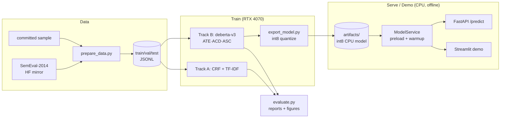

# ABSA — Aspect-Based Sentiment Analysis

Extract **aspects** from review text and predict **sentiment per aspect**
(positive / negative / neutral), covering three sub-tasks — **ATE** (aspect term
extraction), **ACD** (aspect category detection), and **ASC** (aspect sentiment
classification) — behind one call (real output of the deployed int8 model):

```python
text = "The pizza was delicious but the service was painfully slow."
predict(text)
# -> [{"aspect": "pizza",   "sentiment": "positive", "confidence": 0.68, "span": [4, 9]},
#     {"aspect": "service", "sentiment": "negative", "confidence": 0.63, "span": [32, 39]}]
predict_categories(text)
# -> [("service", 0.80), ("food", 0.51)]
```

`span` always indexes the text you passed in (even with extra whitespace or HTML).
Categories are sentence-level and restaurant-only: SemEval-2014 labels categories
for restaurants and does not link them to individual aspect terms.

Two comparable tracks are provided so results can be compared head-to-head:

- **Track A — classical baseline**: spaCy/CRF extraction + TF-IDF → LinearSVC/LogReg. CPU, interpretable.
- **Track B — transformer** (primary): fine-tuned `microsoft/deberta-v3-base` (fallback `bert-base-uncased`).

> **Status:** complete end-to-end — data, both tracks, evaluation, FastAPI serving,
> int8 CPU export, and an offline Streamlit demo. See the roadmap and results below.

## Architecture



## Two target machines

Training and the live demo run on different hardware; the project is designed for both.

| | **Training desktop** | **Demo laptop** |
|---|---|---|
| Hardware | Ryzen 7 7700X · RTX 4070 12 GB · 16 GB | Ryzen 5 7000U (no GPU) · 16 GB |
| Role | fine-tuning (bf16 mixed precision) | **inference only, fully offline** |
| Install | `requirements-gpu.txt` (CUDA 12.4 torch) | `requirements-cpu.txt` (CPU torch) |
| Loads | training checkpoints | int8-quantized artifact from `artifacts/` |

## Quickstart

```bash
# 1. Install (choose one)
make setup          # CPU / demo / dev machine   (or:  ./make.ps1 setup      on Windows)
make setup-gpu      # RTX 4070 training desktop   (or:  ./make.ps1 setup-gpu)

# 2. Prepare data (downloads SemEval-2014 if permitted; else uses committed sample)
make prepare-data

# 3. Train (deberta-v3 = best, reported), then build the CPU demo model
make train          # baseline + deberta-v3 (best accuracy, for the paper)
make evaluate       # comparison tables + figures -> reports/
make train-demo     # fine-tune bert-base-uncased (quantization-friendly)
make export         # int8-quantize the bert model -> artifacts/absa-transformer-int8

# 4. Serve / demo
make serve          # FastAPI at http://localhost:8000  (/docs, /health, /predict)
make demo           # Streamlit demo (CPU, offline)
```

Without GNU Make on Windows, replace `make <t>` with `./make.ps1 <t>`.

> **Why two transformer models?** `deberta-v3-base` gives the best accuracy and is
> the reported model, but it degrades badly under dynamic int8 quantization (its
> disentangled-attention layers are quant-sensitive). The **demo** therefore ships a
> quantized **`bert-base-uncased`** model, which quantizes cleanly and runs in
> **~36 ms/inference** (p95 43 ms, 545 MB int8 artifact) on the desktop's Ryzen 7 7700X
> CPU — well under the 1-second target. Run `make benchmark` on the demo laptop for its
> own number; it records the CPU in `reports/benchmark.json`.

## Deploying to the demo laptop

The laptop runs **inference only, offline, no GPU, no Docker**:

1. On the desktop: `make train-demo && make export`. This writes the
   **int8-quantized** deployment artifact to `artifacts/absa-transformer-int8/`
   (~545 MB, CPU-only, self-contained). It stores weights only (config + quantized
   `state_dict` per task, loaded with `torch.load(weights_only=True)`), so no code is
   unpickled on the laptop. Export also tunes the int8 model's category threshold on
   the validation split. Artifacts from older versions (`ate.pt`, …) must be
   re-exported.
2. Copy the repo **and the `artifacts/absa-transformer-int8/` folder** to the laptop
   (artifacts are gitignored because they're large — transfer them manually).
3. On the laptop: `make setup` (installs the **CPU-only** stack), then `make demo`.
4. The demo preloads the artifact and runs a warmup inference at startup, so the
   first live prediction is fast — no downloads, no GPU, no Docker. Run
   `make benchmark` once on the laptop to record its latency.

## Development

```bash
make test      # pytest + coverage (≥ 70%)
make lint      # ruff + black --check
make type      # mypy
make format    # auto-fix + format
make check     # lint + type + test
make benchmark    # CPU latency + size -> reports/benchmark.json (records the CPU)
make train-seeds  # deberta-v3 x 3 seeds -> mean/std in reports/seed_variance.json
```

Config: environment/secrets via `.env` (see `.env.example`, prefix `ABSA_`);
experiment config via YAML in `configs/`. Experiments tracked with MLflow.

## Results

Track A vs Track B on the official **SemEval-2014** test split (1,600 sentences),
both scored through the same char-exact evaluation code path
(`reports/comparison.md`, figures in `reports/figures/`):

| Task | Metric | Track A — baseline | Track B — deberta-v3 |
|---|---|---|---|
| ATE | span-F1 | 0.732 | **0.867** |
| ACD | micro-F1 | 0.801 | **0.906** |
| ASC | macro-F1 | 0.599 | **0.804** |
| ASC | accuracy | 0.693 | **0.860** |

Neutral is the hardest sentiment class for both tracks (the classic ABSA
pattern); categories exist only for restaurants in SemEval-2014.
`reports/comparison.md` also breaks every metric down **per domain**
(restaurants / laptops), as SemEval results are usually reported. Aspects
labelled `conflict` are dropped from the gold data, so ATE numbers are not
directly comparable to papers that keep them. All numbers are a single seed (42);
`make train-seeds` measures seed variance.

**Deployed CPU model** (int8-quantized `bert-base-uncased`, what the demo runs):
ATE span-F1 **0.807**, ACD micro-F1 **0.858**, ASC macro-F1 **0.724** — between the
baseline and deberta-v3, at ~36 ms/inference on the desktop CPU
(`reports/deploy_int8_metrics.json`, `reports/benchmark.json`; both regenerated by
`make evaluate` / `make benchmark`).

## Roadmap

- [x] **P0** Scaffold — packaging, config, logging, tooling, CI, docs.
- [x] **P1** Data — SemEval-2014 parser + fetch, splits, committed sample, dataset card.
- [x] **P2** Track A baseline — CRF (ATE) + TF-IDF/LogReg (ACD/ASC); trained + evaluated.
- [x] **P3** Track B transformer — `deberta-v3-base` fine-tuned (ATE/ACD/ASC), bf16 on RTX 4070, MLflow.
- [x] **P4** Evaluation — unified Track A vs B scoring, confusion matrices, figures in `reports/`.
- [x] **P5** Serving — FastAPI `/predict` (+ batch) & `/health`, pydantic schemas, warmup, `/docs`.
- [x] **P5.5** CPU export — int8-quantized bert artifact (`make export`) + `make benchmark` (~36 ms/inference on the 7700X).
- [x] **P6** Demo — Streamlit UI (offline, cached examples, color-coded aspects), loads the int8 artifact.
- [x] **P7** Docker & CI — `docker/` (Dockerfile + compose, API + demo), GitHub Actions (lint/type/test).
- [x] **P8** Docs & paper — model card, dataset card, IEEE paper skeleton, architecture diagram.

## Reports & docs

- `reports/PROJECT_REPORT.md` — full project report (idea, codebase, results, hurdles, future scope).
- `reports/comparison.md` + `reports/figures/` — Track A vs B results and figures.
- `reports/model_card.md` — intended use, metrics, limitations, bias/fairness, SDGs.
- `reports/dataset_card.md` — SemEval-2014 source, splits, distribution, license.
- `reports/paper/paper.md` — IEEE-style paper skeleton, pre-filled from real results.

## License

MIT — see [LICENSE](LICENSE).
